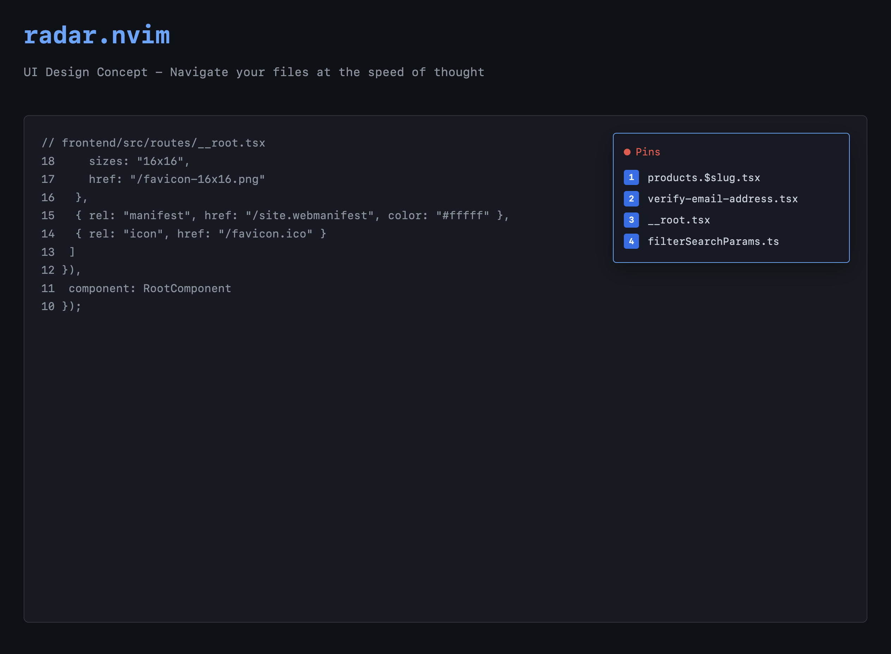
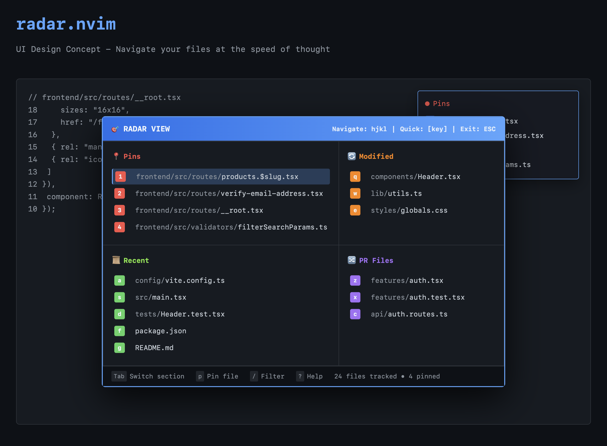

# radar.nvim

> Navigate your files like a fighter pilot.

A Neovim plugin that treats file navigation like a fighter pilot's radar system. Your most important files are "locked targets" that you can instantly access, while other files appear as "blips" on your radar for quick identification and engagement.

## ✨ Concept

`radar.nvim` provides **instant access** to your working files through spatial keyboard shortcuts, eliminating the need for fuzzy finders or file trees for your active working set.

- **📍 File Pinning**: Lock your most important files to slots 1-9 for instant access
- **🎯 Smart Persistence**: Context-aware storage per project and git branch
- **⚡ Dynamic Highlighting**: Auto-highlight the currently active pinned file
- **🛡️ Robust Error Handling**: Graceful handling of special characters and edge cases

See also [Concept](./docs/concept.md)

**Mini** Radar



**Full** Radar



**Keybindings**

```
[1][2][3][4][5][6][7][8][9]  ← Loks (manually locked targets)
[q][w][e][r][t]              ← Modified files (git status)
[a][s][d][f][g]              ← Recent files (vim.v.oldfiles)
[z][x][c][v][b]              ← PR files (branch changes)
```

This spatial keyboard layout gives you instant access to **24 files** without moving your left hand from home position.

## 📦 Installation

### Using [lazy.nvim](https://github.com/folke/lazy.nvim)

```lua
{
  "black-atom-industries/radar.nvim",
  opts = {
    -- Optionally customize window preset
    radar = {
      win_preset = "top_right",  -- or "center", "center_large", "cursor", "bottom_center", "full_height_sidebar"
    }
  }
}
```

### Configuration Examples

**Simple customization:**
```lua
{
  "black-atom-industries/radar.nvim",
  opts = {
    -- Override a preset width
    win_presets = {
      center = { width = 100 }
    },

    radar = {
      win_preset = "center",
      max_recent_files = 10,
      titles = {
        main = "MY RADAR",
        locks = "LOCKED",
      }
    }
  }
}
```

**Advanced customization:**
```lua
{
  "black-atom-industries/radar.nvim",
  opts = {
    -- Create custom preset
    win_presets = {
      my_preset = function(config)
        return {
          relative = "editor",
          width = 80,
          height = 15,
          row = 5,
          col = vim.o.columns - 85,
          border = "rounded",
          style = "minimal",
          title = config.radar.titles.main,
          title_pos = "left",
          focusable = true,
          zindex = 100,
        }
      end
    },

    radar = {
      win_preset = "my_preset"
    }
  }
}
```

## 🎮 Usage

### Default Keybindings

**Global:**
- **`<space>`**: Toggle radar window

**Within Radar Window:**
- **`l`**: Lock current buffer (from source window)
- **`1-9`**: Open locked files
- **`a-g`**: Open recent files
- **`<space>`**: Open alternative file (e.g., test ↔ implementation)
- **`e`**: Edit lock labels
- **`q` / `<Esc>`**: Close radar

**Line-based Navigation (within radar):**
- **`<CR>`**: Open file under cursor
- **`V`**: Open in vertical split
- **`S`**: Open in horizontal split
- **`T`**: Open in new tab
- **`F`**: Open in floating window

**Split Modifiers (combine with 1-9, a-g, or `<space>`):**
- **`<C-v>` + key**: Open in vertical split
- **`<C-s>` + key**: Open in horizontal split
- **`<C-t>` + key**: Open in new tab
- **`<C-f>` + key**: Open in floating window

### Context-Aware Persistence

Locks are automatically saved and restored per project and git branch, so switching between projects or branches maintains separate lock sets.

## 🧪 Testing

This plugin includes comprehensive tests using [mini.test](https://github.com/echasnovski/mini.test) with busted-style syntax.

### Available Commands

| Command | Description | Dependencies |
|---------|-------------|--------------|
| `make validate` | Validate test setup | None |
| `make test` | Run all tests | None |
| `make test-path` | Run only path utility tests | None |
| `make test-watch` | Watch for changes and run tests | `entr` (`brew install entr`) |
| `make lint` | Lint Lua files | `stylua` (`brew install stylua`) |
| `make format` | Format Lua files | `stylua` (`brew install stylua`) |
| `make clean` | Clean test artifacts | None |
| `make help` | Show all available commands | None |

### Test Coverage

- **Path Shortening**: 18+ test cases covering width constraints, home directory replacement, ellipsis handling, and edge cases
- **Smart Path Display**: Tests ensure long file paths fit within sidebar width while maintaining readability

### Writing Tests

Tests are located in `test/spec/` and use mini.test with busted emulation:

```lua
describe("my feature", function()
  it("should work correctly", function()
    MiniTest.expect.equality(result, expected)
  end)
end)
```

## 🏗️ Architecture

This is a **learning project** demonstrating:

- Context-aware persistence with nested data structures
- Dynamic UI management with floating windows
- Extmarks for visual highlighting
- Safe string handling for special characters
- Robust error handling in dynamic environments

## 🎨 Interface Preview

```
┌─────────────────────────────┐
│ 󰐷  RADAR                   │
│                             │
│ 󰋱  LOCKED IN               │
│   [1] lua/radar/init.lua    │
│   [2] lua/radar/config.lua  │ ← highlighted (currently active)
│   [3] test/spec/state.lua   │
│                             │
│   OTHER                    │
│   [<space>] test/init.lua   │
│                             │
│ 󰽏  NEAR                    │
│   [a] README.md             │
│   [s] CLAUDE.md             │
└─────────────────────────────┘
```

## 📋 Roadmap

### ✅ Completed (v0.5)

- [x] File locking with 1-9 keybindings
- [x] Context-aware persistence (per project + git branch)
- [x] Dynamic highlighting of current file
- [x] Floating window UI with customizable presets
- [x] Recent files section (vim.v.oldfiles integration)
- [x] Alternative file support (test ↔ implementation)
- [x] Line-based navigation in radar window
- [x] Multiple split modes (vertical, horizontal, tab, float)
- [x] Lock label editing
- [x] Flexible window preset system

### 🎯 Future (v1.0+)

- [ ] Modified files section (git integration)
- [ ] PR files section (branch changes)
- [ ] Full radar view (on-demand comprehensive view)
- [ ] Enhanced navigation between sections
- [ ] Automatic reordering of labels after deletion
- [ ] Non-git project support

## 🤝 Contributing

This is primarily a learning project focused on understanding Neovim plugin development patterns. Contributions are welcome, but please:

- Explain the "why" behind changes
- Maintain the spatial keybinding philosophy
- Keep code simple and educational
- Test with both basic and edge cases

## 📚 Learn More

- [docs/concept.md](docs/concept.md) - Comprehensive design vision and philosophy
- [CLAUDE.md](CLAUDE.md) - Technical architecture and development patterns

## 📄 License

MIT
